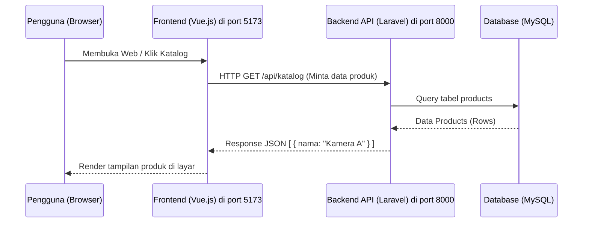

# Visualisasi Struktur Project Terkini

Setelah proses *decoupling*, project Anda kini memiliki dua tulang punggung utama: **Backend API** (Laravel) dan **Frontend Web App** (Vue JS).

## 1. Arsitektur Komunikasi (Mermaid Diagram)
Berikut adalah bagaimana kedua bagian tersebut saling berkomunikasi. Frontend tidak lagi diproses secara langsung oleh Laravel, melainkan Frontend memanggil (me-request) data JSON ke Laravel API.



---

## 2. Struktur Folder Utama
Di bawah ini adalah ilustrasi struktur folder *Sewa Kamera* saat ini. Perhatikan bahwa folder `frontend/` kini berdiri sendiri layaknya *project* di dalam *project*.

```text
sewa-kamera/ (Project Root)
├── app/
│   ├── Http/
│   │   └── Controllers/     <-- Berisi API Controllers (mengembalikan JSON)
│   │       ├── AdminController.php
│   │       ├── AuthController.php
│   │       ├── BookingController.php
│   │       └── ...
│   └── Models/              <-- Representasi Database (Produk, User, Booking)
│
├── database/                <-- Tempat tabel (migrations) & data awal (seeders)
│
├── frontend/                <-- [BARU] PROJECT VUE.JS ANDA ADA DI SINI
│   ├── node_modules/        <-- Dependensi JS (Vue, Axios, Router)
│   ├── public/              <-- Aset publik khusus frontend
│   ├── src/                 <-- TEMPAT ANDA NGODING TAMPILAN
│   │   ├── assets/          <-- CSS, Gambar logo
│   │   ├── components/      <-- Potongan UI (Misal: Navbar, CardProduk)
│   │   ├── views/           <-- Halaman Utuh (Login.vue, Katalog.vue, Dashboard.vue)
│   │   ├── App.vue          <-- Komponen Induk Vue
│   │   └── main.js          <-- Entry point Vue & inisialisasi Router
│   ├── package.json         <-- Daftar plugin Vue (npm)
│   └── vite.config.js       <-- Konfigurasi build (Port 5173)
│
├── resources/
│   └── views/               <-- File tampilan lama (Blade). Boleh dibiarkan sbg contekan.
│
├── routes/
│   ├── api.php              <-- [AKTIF] Semua URL untuk API berada di sini
│   └── web.php              <-- [TIDAK TERPAKAI/KOSONG] Tampilan web kini diurus oleh Vue.
│
└── .env                     <-- File Konfigurasi Database Utama
```

### Kesimpulan
- **Kalau ingin mengubah Tampilan / Halaman Web:** Anda hanya perlu mengutak-atik isi di dalam `frontend/src/`.
- **Kalau ingin menambah logika Database / Fitur Backend:** Anda perlu memodifikasi `app/Http/Controllers/` dan mendaftarkan URL-nya di `routes/api.php`.
